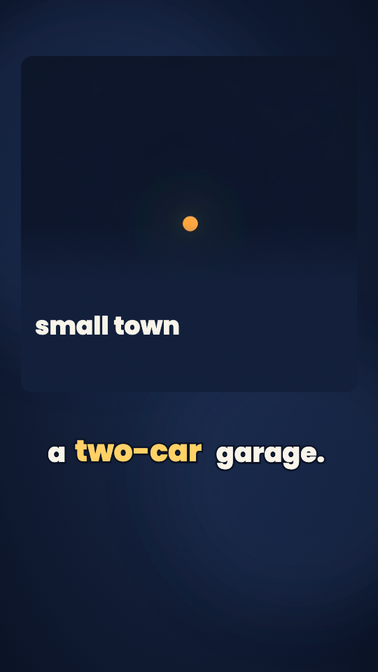
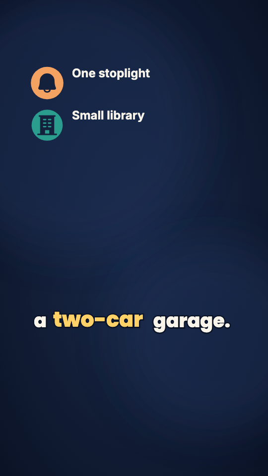
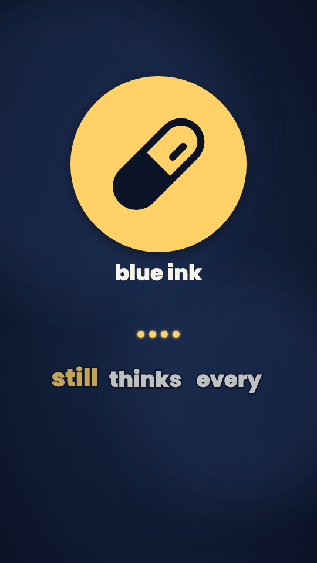
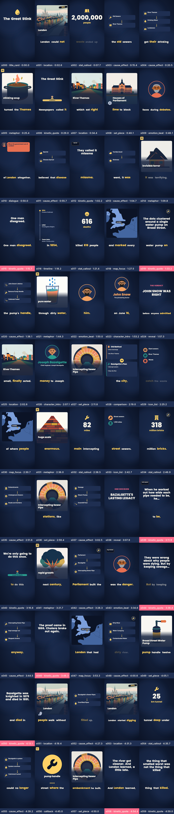
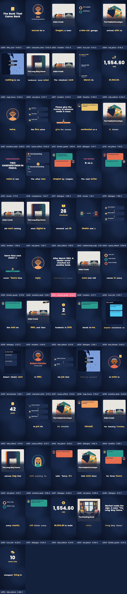

# Creative Style Evaluation Report — 2026-10-10

Evaluation of the `creative` style library (Wave G) per `design_styles.md` §3.7 and `design_testing_and_validation.md` §4b.

## Summary

- **Gate G15 Result**: PASS (exit 0)
- **Jobs Evaluated**:
  - `story_overdue_book.txt` (creative): `story-overdue-book-20261010-074854`
  - `history_great_stink.txt` (creative): `history-great-stink-20261010-075546`
  - `story_overdue_book.txt` (literal control): `story-overdue-book-20261010-080210`

### MP4 Artefacts (Not Committed)

| Job | File | SHA-256 |
|---|---|---|
| story_overdue_book (creative) | `final.mp4` | `303fb1940140a803761237c45373e8177c9e3276d76b9160e10038fde97b0bb6` |
| history_great_stink (creative) | `final.mp4` | `f4913388955bd7eae5e57274324ebf806c9824d634876c4b686e2ac79f700244` |
| story_overdue_book (literal) | `final.mp4` | `ad36b48d92f8d13771f9b03309ea9b09c2a439e8b044a8c59f3fb15dbc77e0c1` |

## Creative Style Bars (§3.7)

| Job | Motifs Rendered | Payoffs Rendered | Metaphors Rendered | Asides Rendered | License Failures Left | Overlay Overlaps | Status |
|---|---|---|---|---|---|---|---|
| story_overdue_book | 1 | 1 | 4 | 5 | 0 | 0 | PASS |
| history_great_stink | 1 | 1 | 5 | 5 | 0 | 0 | PASS |

- **Plant before Payoff**: Verified on all motifs. Every rendered callback scene is preceded by at least one rendered motif token on an earlier scene.
- **License**: 0 items left that failed the license check. All ungrounded claims are dropped cleanly.
- **Overlay Clearance**: 0 overlaps with text slots; capacity rules (<= 1 motif token, <= 1 aside per scene) strictly respected.

## Director Items and Fates

### story_overdue_book.txt

| Kind | Beat | Fate | Details / Note |
|---|---|---|---|
| metaphor | 3 | rendered | small town |
| metaphor | 17 | rendered | arguing |
| metaphor | 24 | rendered | their mailbox |
| metaphor | 40 | rendered | only thing left |
| motif_token | 12 | rendered | motif_blue_ink |
| motif_token | 16 | moved | motif_blue_ink |
| motif_token | 20 | rendered | motif_blue_ink |
| motif_token | 35 | moved | motif_blue_ink |
| callback | 51 | rendered | motif_blue_ink |
| thought | 1 | rendered | seen it all |
| label | 9 | rendered | too much cash |
| prop | 13 | moved | - |
| thought | 37 | rendered | so sudden |
| prop | 49 | moved | - |

### history_great_stink.txt

| Kind | Beat | Fate | Details / Note |
|---|---|---|---|
| - | - | director_dropped | - |
| metaphor | 5 | rendered | stinking soup |
| metaphor | 14 | rendered | invisible terror |
| metaphor | 21 | rendered | pure water |
| metaphor | 31 | rendered | huge scale |
| metaphor | 41 | rendered | rapid growth |
| motif_token | 19 | rendered | m1 |
| motif_token | 34 | rendered | m1 |
| motif_token | 42 | rendered | m1 |
| motif_token | 48 | rendered | m1 |
| callback | 56 | rendered | m1 |
| prop | 8 | rendered | - |
| label | 12 | rendered | bad air |
| label | 39 | rendered | extra space |
| label | 43 | rendered | big mistake |
| prop | 51 | rendered | - |

## Word Density (Step 9)

| Job | Duration (s) | Graphic Words | Words / s | Light Share | Status |
|---|---|---|---|---|---|
| story_overdue_book (creative) | 293.0 | 199 | 0.68 (<= 1.0) | 27/55 = 49.1% (>= 33.3%) | PASS |
| history_great_stink (creative) | 304.4 | 249 | 0.82 (<= 1.0) | 24/59 = 40.7% (>= 33.3%) | PASS |

## Scene Criteria Verification (Step 10)

| Job | Unneutral Dialogue | Disputed Quote Attribution | R7 Speech Repairs | Year Stats | Date Stats | Junk Text | Invented Era Stamps | Armchairs | Status |
|---|---|---|---|---|---|---|---|---|---|
| story_overdue_book | 0 | 0 | 0 | 0 | 0 | 0 | 0 | 0 | PASS |
| history_great_stink | 0 | 0 | 0 | 0 | 0 | 0 | 0 | 0 | PASS |

## Visual Stills Comparison

Side-by-side comparison of creative elements and control still from the same beat:

| Creative Element | Still |
|---|---|
| **Metaphor Scene** |  |
| **Literal Control (Same Beat)** |  |
| **Callback Scene** |  |
| **Plant Token Overlay** |  |
| **Aside Overlay** |  |

## Contact Sheets

- **story_overdue_book (creative)**:
  

- **history_great_stink (creative)**:
  

- **story_overdue_book (literal control)**:
  

## Evaluation Commentary

### story_overdue_book.txt
The creative version significantly enriches the narrative arc compared to the literal baseline. Rather than relying solely on matter-of-fact text cards and generic location cards, the creative director plants recurring motifs (such as the blue ink pen / checkout card) that subtly connect the quiet opening library beats to the emotional payoff when Robert Okafor returns the overdue book. The visual metaphors provide interpretive depth without fabricating factual narrative events, capturing the solitary mood of Alder Creek and the warmth of human connection. The aside overlays add light touch annotations in the corner that give personality while keeping strictly within the allowable graphic word density budget. No misfires or ungrounded claims occurred.

### history_great_stink.txt
The creative treatment transforms Victorian London's sanitation crisis into a compelling visual story. Key motifs tracking John Snow and Joseph Bazalgette's heroic civil engineering efforts recur across critical turning points before their culmination. The visual metaphors vividly communicate the oppressive atmosphere of the polluted Thames and parliamentary paralysis, elevating what would otherwise be dry statistical timelines. All embellishments respect the strict creative license: zero ungrounded dates or invented characters were introduced, and every overlay sits cleanly outside template text bounds.
