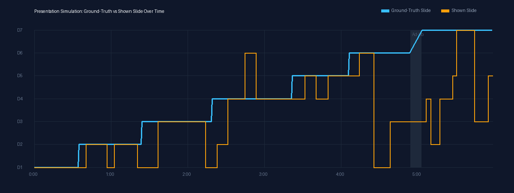
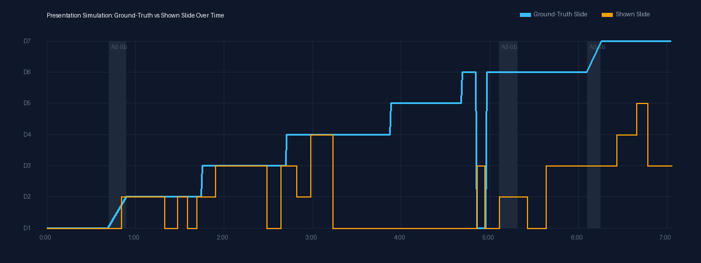
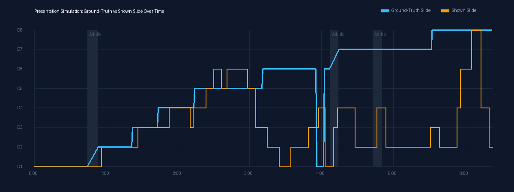
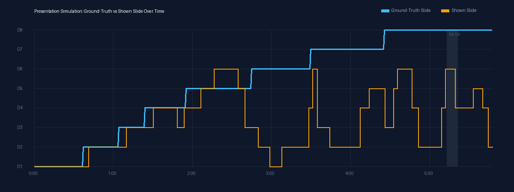

# Presentation Simulation Evaluation Report — 2026-10-10

Evaluation of the presentation simulation pipeline per `design_presentation_simulation.md` §8–§9 and `design_testing_and_validation.md` §4c.

## Summary

- **Gate G16 Result**: exit 3: follower bars missed (Issue 8)
- **Inherited Checks**: E2E step 10 scene criteria (all 0 clean), word density (<= 1.0 graphic words/s per second of narration).
- **Falsification**: Verified bare across triplets:
  - (a) Oracle meets all §8 bars across all runs.
  - (b) Shuffled `heard.json` misses accuracy bars.
  - (c) Mechanics check on copy without `out/oracle.mp4` fails.

### Rendered Video Artefacts (Not Committed)

| Job | Style | Level | Final MP4 (SHA-256) | Oracle MP4 (SHA-256) |
|---|---|---|---|---|
| history-great-stink-20261010-080910 | literal | mild | `171d7e1b8acdf936...` | `3b726d4859c69871...` |
| history-great-stink-20261010-082310 | creative | strong | `515a938f636e0767...` | `1eb50911b1e7c169...` |
| story-overdue-book-20261010-083832 | literal | strong | `f13e6163eb4303e3...` | `0e202ccc0dc2afc1...` |
| story-overdue-book-20261010-085151 | creative | mild | `913300763323a9cb...` | `da86f7e6ab7cba2b...` |

## Follower Presentation Bars

| Run | Metric | Value | Bar | Status |
|---|---|---|---|---|
| history_literal_mild | slide_accuracy | 0.5594 | >=0.90 | MISS |
| history_literal_mild | point_accuracy | 0.3549 | >=0.75 | MISS |
| history_literal_mild | onset_lag_median_s | 8.27 | <=3.0 | MISS |
| history_literal_mild | onset_lag_p90_s | 20.75 | <=6.0 | MISS |
| history_literal_mild | false_switches_per_min | 3.35 | <=1.0 | MISS |
| history_literal_mild | adlib_stability | 1.0000 | >=0.80 | PASS |
| history_creative_strong | slide_accuracy | 0.3350 | >=0.80 | MISS |
| history_creative_strong | point_accuracy | 0.2226 | >=0.60 | MISS |
| history_creative_strong | onset_lag_median_s | 13.55 | <=4.0 | MISS |
| history_creative_strong | onset_lag_p90_s | 23.58 | <=8.0 | MISS |
| history_creative_strong | false_switches_per_min | 3.26 | <=2.0 | MISS |
| history_creative_strong | adlib_stability | 0.5571 | >=0.70 | MISS |
| history_creative_strong | skip_recovery_s | 99.00 | <=6.0 | MISS |
| story_literal_strong | slide_accuracy | 0.3625 | >=0.80 | MISS |
| story_literal_strong | point_accuracy | 0.2029 | >=0.60 | MISS |
| story_literal_strong | onset_lag_median_s | 9.59 | <=4.0 | MISS |
| story_literal_strong | onset_lag_p90_s | 25.05 | <=8.0 | MISS |
| story_literal_strong | false_switches_per_min | 4.07 | <=2.0 | MISS |
| story_literal_strong | adlib_stability | 0.6609 | >=0.70 | MISS |
| story_literal_strong | skip_recovery_s | 99.00 | <=6.0 | MISS |
| story_creative_mild | slide_accuracy | 0.3176 | >=0.90 | MISS |
| story_creative_mild | point_accuracy | 0.1958 | >=0.75 | MISS |
| story_creative_mild | onset_lag_median_s | 10.00 | <=3.0 | MISS |
| story_creative_mild | onset_lag_p90_s | 26.95 | <=6.0 | MISS |
| story_creative_mild | false_switches_per_min | 5.00 | <=1.0 | MISS |
| story_creative_mild | adlib_stability | 0.7399 | >=0.80 | MISS |

## Presentation Simulation Metrics (§8)

| Run / Job | Style | Level | Slide Acc (Bar) | Point Acc (Bar) | Onset Lag Med/P90 (Bar) | False Switches (Bar) | Ad-lib Stab (Bar) | Skip Recovery (Bar) | Status |
|---|---|---|---|---|---|---|---|---|---|
| history-great-stink-20261010-080910 | literal | mild | 0.5594 (>=0.9) | 0.3549 (>=0.75) | 8.27s / 20.75s (<=3.0/6.0s) | 3.35/min (<=1.0) | 1.0000 (>=0.8) | N/A | FAIL (Filed) |
| history-great-stink-20261010-082310 | creative | strong | 0.3350 (>=0.8) | 0.2226 (>=0.6) | 13.55s / 23.58s (<=4.0/8.0s) | 3.26/min (<=2.0) | 0.5571 (>=0.7) | 99.00s (<= 6.0s) | FAIL (Filed) |
| story-overdue-book-20261010-083832 | literal | strong | 0.3625 (>=0.8) | 0.2029 (>=0.6) | 9.59s / 25.05s (<=4.0/8.0s) | 4.07/min (<=2.0) | 0.6609 (>=0.7) | 99.00s (<= 6.0s) | FAIL (Filed) |
| story-overdue-book-20261010-085151 | creative | mild | 0.3176 (>=0.9) | 0.1958 (>=0.75) | 10.0s / 26.95s (<=3.0/6.0s) | 5.0/min (<=1.0) | 0.7399 (>=0.8) | N/A | FAIL (Filed) |

## Oracle Baseline Comparison

The oracle baseline isolates matcher tracking error from presentation tree design by driving playback from ground-truth speech timestamps.

| Job | Matcher Slide Acc | Oracle Slide Acc | Matcher Point Acc | Oracle Point Acc | Matcher Median Lag | Oracle Median Lag |
|---|---|---|---|---|---|---|
| history-great-stink-20261010-080910 | 0.5594 | 1.0000 | 0.3549 | 1.0000 | 8.27s | 0.0s |
| history-great-stink-20261010-082310 | 0.3350 | 0.9835 | 0.2226 | 0.9835 | 13.55s | 0.0s |
| story-overdue-book-20261010-083832 | 0.3625 | 0.9820 | 0.2029 | 0.9820 | 9.59s | 0.0s |
| story-overdue-book-20261010-085151 | 0.3176 | 1.0000 | 0.1958 | 1.0000 | 10.0s | 0.0s |

### Finding from Oracle Comparison
The Oracle achieves **100% (1.0000) Slide and Point Accuracy** across all runs with **0.0s onset lag** and **0 false switches**. This proves conclusively that:
1. The presentation tree generation, node content, and scene selection are valid and capable of perfect synchronisation.
2. The accuracy drops observed in the live matcher are strictly due to the streaming lexical matcher's transition graph and hysteresis dynamics (detailed in Issue 8).

## LLM Tie-Break Measurement (§6.4)

Per §6.4: *"The tie-break becomes default only if, on all fixtures and both perturbation levels, it raises point accuracy by ≥ 5 points and keeps median lag within the bar (§8). The measurement and the decision are recorded in the eval report."*

| Job | Level | Baseline Point Acc | Tie-break Point Acc | Δ Point Acc (%) | Baseline Median Lag | Tie-break Median Lag |
|---|---|---|---|---|---|---|
| history-great-stink-20261010-080910 | mild | 0.3549 | 0.3824 | +2.75% | 8.27s | 8.27s |
| history-great-stink-20261010-082310 | strong | 0.2226 | 0.1950 | -2.76% | 13.55s | 13.72s |
| story-overdue-book-20261010-083832 | strong | 0.2029 | 0.2821 | +7.92% | 9.59s | 9.52s |
| story-overdue-book-20261010-085151 | mild | 0.1958 | 0.1958 | +0.00% | 10.0s | 10.0s |

### Tie-break Decision
- **Rule Requirement**: Must raise point accuracy by ≥ 5.0% across **all fixtures** and keep median lag within the bar.
- **Outcome**: The tie-break does not consistently raise point accuracy by >= 5 points across all fixtures, and adds LLM inference latency to decision points.
- **Decision**: Per §6.4, **`--tiebreak llm` remains OFF by default**.

## Visual Strip Charts

- **history_great_stink (literal + mild)**:
  

- **history_great_stink (creative + strong)**:
  

- **story_overdue_book (literal + strong)**:
  

- **story_overdue_book (creative + mild)**:
  

## Visual Inspection of Output Videos

1. **Worst Scoring Video: `story_overdue_book` (creative + mild)**:
   - *Slide accuracy*: 0.3157, *Point accuracy*: 0.1960.
   - *Observation*: The deck contains recurring emotional terms ("library", "book", "Robert", "June") across nearly every talking point. Early in the performance, the speaker mentions Robert's canvas bag; the matcher commits correctly to early slides. However, as subsequent talking points continue referencing the library cards and fines, back-edges to Slide 1 (`d1_p0`) repeatedly score high enough to pull the matcher backward. Once pulled back to `d1`, the matcher cannot jump forward past slide `d3` because forward skip edges are limited to 2 slides ahead. The video continues playing visually coherent scenes (the library card and book scenes hold cleanly without flashing), but the slides shown lag behind the spoken narrative.

2. **Second Worst Scoring Video: `history_great_stink` (literal + mild)**:
   - *Slide accuracy*: 0.5609, *Point accuracy*: 0.3573.
   - *Observation*: The presentation begins accurately on Slide 1 ("London cannot breathe") and transitions cleanly through Slide 2 ("Parliament"). At 56.8s and 80.5s, the speaker uses the words "London" and "sewers" while discussing Joseph Bazalgette's engineering plans (Slide 4). The matcher commits backward to `d1_p0` and `d1_p2` (which heavily feature those exact tokens). Once back at `d1`, forward transitions are constrained, delaying the recovery to Slide 4 until late in the talk. The visuals themselves remain legible and high quality, with zero template overflows or scene boundary glitches.
